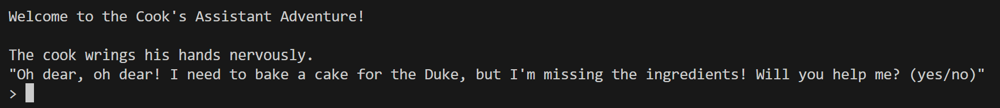

# <Your-Project-Title>

## Description

Text-Adventure that users can imagine when playing the CLI, inspired by the cook's assistant quest in Runescape. Help the cook bake a cake for the duke's birthday. Follow the command instructions to play the game.

## Table of Contents (Optional)

If your README is long, add a table of contents to make it easy for users to find what they need.

- [Installation](#installation)
- [Usage](#usage)
- [Credits](#credits)
- [License](#license)
- [Badges](#badges)
- [Features](#features)
- [How to Contribute](#how-to-contribute)
- [Tests](#tests)

## Installation

Git clone https://github.com/HassanZafar-2021/Text-Adventure.git

cd Text-Adventure

## Usage

python3 main.py to run program

## Credits

https://github.com/HassanZafar-2021

## License

No license.

## Badges

## Features

If your project has a lot of features, list them here.

## How to Contribute

Fork & Clone repo with your own branch and push changes with a PR Request.

## Tests

No test.