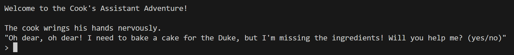
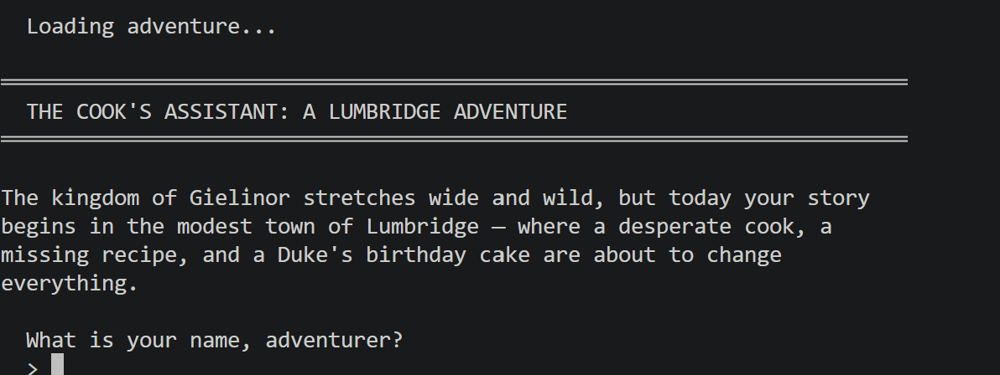

# Text-Adventure

> A CLI text adventure inspired by the Cook's Assistant quest in RuneScape. Help the royal cook bake a cake for the Duke's birthday — before time runs out.

---

## Description

You arrive in Lumbridge to find the castle cook in a panic. The Duke's birthday feast is tonight, and the kitchen is missing three key ingredients. Navigate the town, interact with farmers, millers, and merchants, and return everything to the cook before the countdown hits zero.

The game features a branching world with multiple NPC interactions, a live countdown timer, a reputation system that shapes how characters respond to you, optional side paths, and six different endings depending on how you play.

---

## Table of Contents

- [Installation](#installation)
- [Usage](#usage)
- [Credits](#credits)
- [License](#license)
- [Badges](#badges)
- [Features](#features)
- [How to Contribute](#how-to-contribute)
- [Tests](#tests)

---

## Installation

```bash
git clone https://github.com/HassanZafar-2021/Text-Adventure.git
cd Text-Adventure
```

No external dependencies — runs on Python 3.x out of the box.

---

## Usage

```bash
python3 main.py
```



**Controls:**

| Input | Action |
|---|---|
| `n` / `s` / `e` / `w` | Move north, south, east, west |
| `u` / `d` | Move up or down |
| `take <item>` | Pick up an item |
| `use <item>` | Use an item from your inventory |
| `i` | Open inventory |
| `look` | Re-read the current room |
| `help` | Show all commands |
| `q` | Quit the game |

Exits are always labeled with their destination — e.g. `north (Castle Great Hall)` — so you always know where you're heading.



---

## Credits

[HassanZafar-2021](https://github.com/HassanZafar-2021)

---

## License

No license.

---

## Badges


---

## Features

- **Live countdown timer** — 10 minutes to collect all ingredients and return to the cook. The timer is visible in every prompt and escalates visually as time runs low.
- **12 explorable rooms** — castle halls, a dungeon, a dark forest, a hidden cave, farms, a market stall, and the Duke's own antechamber.
- **Reputation system** — your choices shift your standing in Lumbridge. NPCs remember how you treat them and respond differently based on your reputation.
- **Branching NPC interactions** — multiple ways to obtain each ingredient, including honest requests, trades, mini-puzzles, and riskier options with consequences.
- **Combat system** — fight dungeon enemies with attack, dodge, and flee options. Health persists across the whole run.
- **Optional side quests** — free an imprisoned wizard, uncover an ancient recipe, speak to the Duke, and more.
- **Six distinct endings** — from *Legend of Lumbridge* to *Game Over*, determined by your reputation, choices, and whether you beat the clock.
- **Labeled exits** — every room shows destination names next to each direction so navigation is always clear.

---

## How to Contribute

1. Fork the repository
2. Create a new branch (`git checkout -b feature/your-feature`)
3. Commit your changes (`git commit -m "Add your feature"`)
4. Push to your branch (`git push origin feature/your-feature`)
5. Open a Pull Request

---

## Tests

No tests at this time.